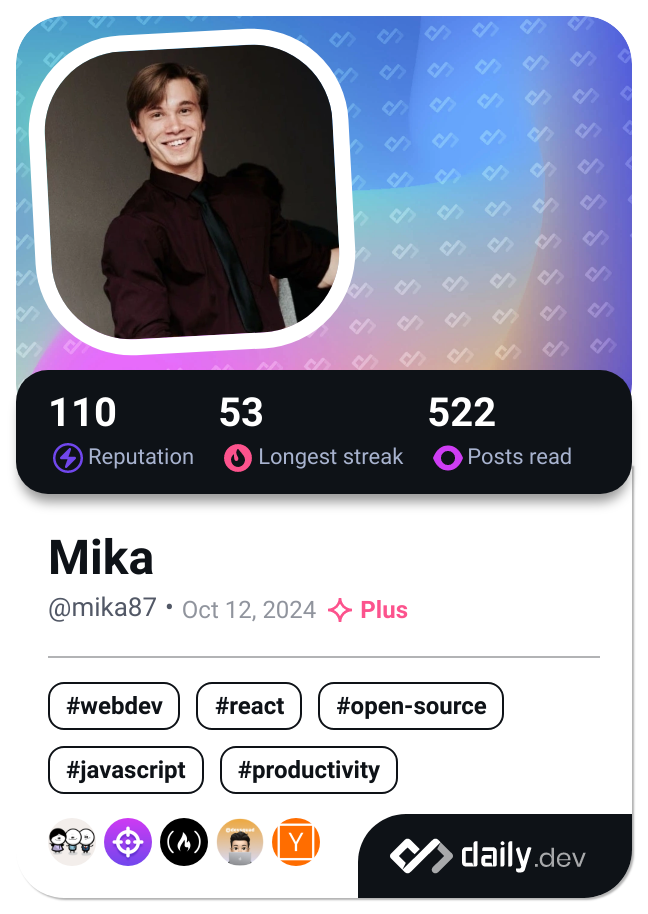

Hi 👋 My name is Mika Sidwell
=============================

Junior Computer and Electronic Engineer
---------------------------------------

I graduated from Northwest University in Potchefstroom in 2024. I also started working for a solar company, Eneframe Batteries, providing solar installation services alongside their lithium iron phosphate battery manufacturing. We ship the lithium cells from China, but everything else, especially the battery management system (BMS), is designed and made locally. I have worked on the low-level embedded code to improve the batteries' operation and add new features such as a programmable auxiliary relay and the integration of a CAN bus for CAN communication to various inverters. Furthermore, I love coding websites as a hobby. Watch this space to see the amazing projects.

*   🌍  I'm based in Gauteng, South Africa
*   ✉️  You can contact me at [mika.sidwell@gmail.com](mailto:mika.sidwell@gmail.com)
*   🧠  I'm learning C, C++, React.js with Next.js.
*   🤝  I'm open to collaborating on anything to help improve my knowledge and skills in embedded coding or web development.
<!---*   🚀  I'm currently working on [Test](http://music.youtube.com/) --->
<!---*   ⚡  Test for now.--->
### Skills 

                    
### Socials      

  <a href="https://www.dev.to/mika_sidwell_541bd1dd0e9d" target="_blank" rel="noreferrer">
<picture>
<source media="(prefers-color-scheme: dark)" srcset="https://raw.githubusercontent.com/danielcranney/readme-generator/main/public/icons/socials/devdotto-dark.svg" />
<source media="(prefers-color-scheme: light)" srcset="https://raw.githubusercontent.com/danielcranney/readme-generator/main/public/icons/socials/devdotto.svg" />

</picture>
</a>
  <a href="https://discord.com/users/coffee.starlord" target="_blank" rel="noreferrer">
<picture>
<source media="(prefers-color-scheme: dark)" srcset="https://raw.githubusercontent.com/danielcranney/readme-generator/main/public/icons/socials/discord-dark.svg" />
<source media="(prefers-color-scheme: light)" srcset="https://raw.githubusercontent.com/danielcranney/readme-generator/main/public/icons/socials/discord.svg" />

</picture>
</a>
  <a href="https://www.facebook.com/profile.php?id=100007701618250" target="_blank" rel="noreferrer">
<picture>
<source media="(prefers-color-scheme: dark)" srcset="https://raw.githubusercontent.com/danielcranney/readme-generator/main/public/icons/socials/facebook-dark.svg" />
<source media="(prefers-color-scheme: light)" srcset="https://raw.githubusercontent.com/danielcranney/readme-generator/main/public/icons/socials/facebook.svg" />

</picture>
</a>
  <a href="https://www.github.com/Mika-127-0-0-1" target="_blank" rel="noreferrer">
<picture>
<source media="(prefers-color-scheme: dark)" srcset="https://raw.githubusercontent.com/danielcranney/readme-generator/main/public/icons/socials/github-dark.svg" />
<source media="(prefers-color-scheme: light)" srcset="https://raw.githubusercontent.com/danielcranney/readme-generator/main/public/icons/socials/github.svg" />

</picture>
</a>
  <a href="http://www.instagram.com/mikasidwell" target="_blank" rel="noreferrer">
<picture>
<source media="(prefers-color-scheme: dark)" srcset="https://raw.githubusercontent.com/danielcranney/readme-generator/main/public/icons/socials/instagram-dark.svg" />
<source media="(prefers-color-scheme: light)" srcset="https://raw.githubusercontent.com/danielcranney/readme-generator/main/public/icons/socials/instagram.svg" />

</picture>
</a>
  <a href="https://www.linkedin.com/in/mika-sidwell-a4a651208" target="_blank" rel="noreferrer">
<picture>
<source media="(prefers-color-scheme: dark)" srcset="https://raw.githubusercontent.com/danielcranney/readme-generator/main/public/icons/socials/linkedin-dark.svg" />
<source media="(prefers-color-scheme: light)" srcset="https://raw.githubusercontent.com/danielcranney/readme-generator/main/public/icons/socials/linkedin.svg" />

</picture>
</a>
  <a href="https://www.stackoverflow.com/users/25289048/mika-sidwell" target="_blank" rel="noreferrer">
<picture>
<source media="(prefers-color-scheme: dark)" srcset="https://raw.githubusercontent.com/danielcranney/readme-generator/main/public/icons/socials/stackoverflow-dark.svg" />
<source media="(prefers-color-scheme: light)" srcset="https://raw.githubusercontent.com/danielcranney/readme-generator/main/public/icons/socials/stackoverflow.svg" />

</picture>
</a>

                    

### Badges
<b>My GitHub Stats</b>

### Support Me

<ul style="list-style-type: none; margin: 0;">

<li style="display: inline-block; margin-right: 0.25rem;"></li>

</ul>
